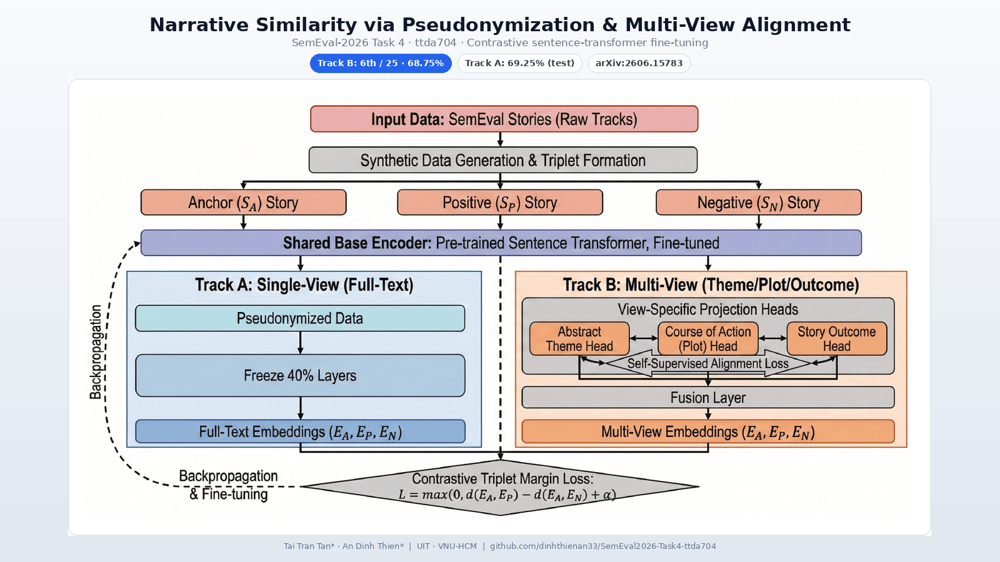
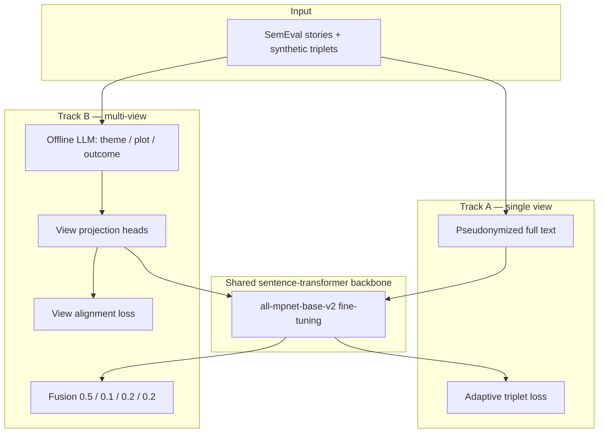

# SemEval-2026 Task 4 — Narrative Similarity (ttda704)

**Contrastive fine-tuning of sentence transformers for narrative similarity**, with entity pseudonymization and multi-view alignment over theme, plot, and outcome.

[](https://arxiv.org/abs/2606.15783)
[](https://www.codabench.org/competitions/10273)



## Overview

[SemEval-2026 Task 4](https://arxiv.org/abs/2606.15783) (*Narrative Story Similarity and Narrative Representation Learning*) asks systems to judge **which of two candidate stories is narratively closer to an anchor**, considering abstract **theme**, **course of action**, and **outcome**—not surface word overlap.

This repository implements the **ttda704** shared-task entry by **Tai Tran Tan\*** and **An Dinh Thien\*** (\*equal contribution), University of Information Technology (UIT), VNU-HCM. The approach:

1. **Pseudonymize** entities with consistent placeholders so models focus on structure rather than proper-noun overlap.
2. **Fine-tune** a sentence-transformer backbone with **contrastive triplet loss** on synthetic narrative triplets.
3. **Track B** additionally decomposes stories into **theme / plot / outcome** views (LLM extraction offline) and fuses view embeddings with self-supervised alignment.

Paper: [ttda704 at SemEval-2026 Task 4: Modeling Narrative Structures via Pseudonymization and Multi-View Sentence Alignment](https://arxiv.org/abs/2606.15783)

## Results

Official private-test scores from our system description paper (accuracy / score on the task metric):

| Track | Task | Our score | Rank | Top score |
|-------|------|-----------|------|-----------|
| **A** | Which candidate is closer to the anchor? | **69.25%** | 14 / 42 | 78.00% |
| **B** | Story embeddings (cosine similarity) | **68.75%** | 6 / 25 | 72.00% |

Pseudonymization improved Track A for the submitted backbone (**all-mpnet-base-v2**: 66.50% → 69.25% on test in the paper’s ablation).

## Approach



The card image above is adapted from **Figure 1** in the arXiv paper (high-level pipeline).

### Submitted models vs. this repo

The **competition submission** used **`sentence-transformers/all-mpnet-base-v2`** for both tracks (768-dim mean pooling, smart layer freezing on the bottom 40% of layers). In this codebase:

| Component | Backbone in repo | Notes |
|-----------|------------------|--------|
| Paper / final submission | `all-mpnet-base-v2` | Described in [arXiv:2606.15783](https://arxiv.org/abs/2606.15783) |
| `configs/track_b_multiview.yaml`, `src/models/multiview_net.py` | `all-mpnet-base-v2` | Matches the paper’s Track B design |
| `configs/track_a_mpnet.yaml` | `all-MiniLM-L6-v2` | Filename says “mpnet”; config still points at MiniLM |
| `scripts/train_track_b.py` | `all-MiniLM-L6-v2` (hardcoded) | Single-view triplet script; does **not** load `track_b_multiview.yaml` |

To reproduce the paper’s Track A setup, point Track A config (or code) at **`all-mpnet-base-v2`** and use pseudonymized training data.

## Repository layout

```
SemEval2026-Task4-ttda704/
├── configs/
│   ├── track_a_mpnet.yaml       # Track A hyperparameters (YAML)
│   ├── track_b_multiview.yaml   # Track B fusion / loss weights
│   └── prompt_templates.yaml    # LLM extraction prompt (Track B)
├── data/
│   └── raw/train/               # ~19 MB synthetic training JSONL committed here
├── docs/assets/card.png         # README / portfolio card (16:9)
├── notebooks/                   # EDA & error analysis (expect dev files locally)
├── scripts/
│   ├── train_track_a.py         # Track A training entry point
│   ├── train_track_b.py         # Track B single-view training + embedding export
│   ├── generate_submission.py   # Build track_b.npy / submission zip
│   └── run_preprocess.sh        # LLM narrative extraction wrapper
├── src/
│   ├── data_processing/         # Datasets, OpenAI batch extractor
│   ├── models/                  # EmbedModel, MultiViewEncoder
│   ├── training/                # Losses, trainer_track_a/b loops
│   └── utils/
├── requirements.txt
└── README.md
```

### Data in git

The README previously stated that `data/` is not pushed. **That is outdated.** This repo **does** include synthetic training files under `data/raw/train/` (on the order of **~19 MB**), for example:

- `synthetic_narrative_data_v2.jsonl`
- `synthetic_data_for_contrastive_learning.jsonl`
- `synthetic_data_for_classification.jsonl`
- `cleaned_merged_data.jsonl`
- `sample_track_a.jsonl`, `sample_track_b.jsonl` (small samples)

**Not** committed: official SemEval **dev/test** JSONL at paths such as `data/raw/dev_track_a.jsonl`, pseudonymized `data/processed/`, and LLM outputs under `data/llm_extracted/`. Download competition data via [Kaggle Hub](https://www.kaggle.com/) (see below) or Codabench, then place files where configs and notebooks expect them.

## Setup

**Requirements:** Python 3.8+, PyTorch 2.x, and a CUDA GPU for practical training (paper experiments used an RTX 3090).

```bash
git clone https://github.com/dinhthienan33/SemEval2026-Task4-ttda704.git
cd SemEval2026-Task4-ttda704
pip install -r requirements.txt
```

Copy environment variables from `.env.example` when using LLM extraction or Weights & Biases:

```bash
export OPENAI_API_KEY="..."   # required for src/data_processing/llm_extractor.py
export WANDB_API_KEY="..."    # optional
```

### Optional: download task data

```bash
python -c "from src.utils.common import download_and_prepare; download_and_prepare('dinhthienan33/semeval-2026-task-4-track-b')"
```

Adjust `configs/*.yaml` training paths if your files differ (e.g. `track_a_mpnet.yaml` references `data/raw/synthetic_cleaned.jsonl`, which is not in git—use `data/raw/train/cleaned_merged_data.jsonl` or another committed file).

## Usage

**Track A (classification via embeddings + cosine similarity on dev triples):**

```bash
python scripts/train_track_a.py --config configs/track_a_mpnet.yaml
```

**Track B — script in repo (single-view contrastive + test encoding):**

```bash
python scripts/train_track_b.py
```

**Track B — multi-view module (paper method):** implementation lives in `src/models/multiview_net.py` and `src/training/trainer_track_b.py`, with hyperparameters in `configs/track_b_multiview.yaml`. Wire a small driver or notebook to call `train_multiview` if you extend beyond the bundled `train_track_b.py` script.

**LLM preprocessing (theme / plot / outcome JSON):**

```bash
./scripts/run_preprocess.sh
```

**Submission embeddings:**

```bash
python scripts/generate_submission.py \
  --model-dir checkpoints/track_a \
  --dev-track-b data/raw/dev_track_b.jsonl \
  --dev-track-a data/raw/dev_track_a.jsonl
```

(Requires a trained checkpoint and local dev/test JSONL files.)

## Team & links

- **Authors:** Tai Tran Tan\*, An Dinh Thien\* — UIT, Vietnam National University Ho Chi Minh City
- **Portfolio:** [portfolio.dinhthienan203.id.vn](https://portfolio.dinhthienan203.id.vn)
- **Competition:** [Codabench — SemEval-2026 Task 4](https://www.codabench.org/competitions/10273)
- **Task site:** [narrative-similarity-task](https://github.com/narrative-similarity-task/narrative-similarity-task.github.io)
- **Baselines:** [semeval-2026-task-4-baselines](https://github.com/narrative-similarity-task/semeval-2026-task-4-baselines)

## Citation

If you use this code or method, please cite:

```bibtex
@article{tan2026ttda704,
  title={ttda704 at SemEval-2026 Task 4: Modeling Narrative Structures via Pseudonymization and Multi-View Sentence Alignment},
  author={Tan, Tai Tran and Thien, An Dinh},
  journal={arXiv preprint arXiv:2606.15783},
  year={2026},
  url={https://arxiv.org/abs/2606.15783}
}
```

## License

License: not yet specified.
